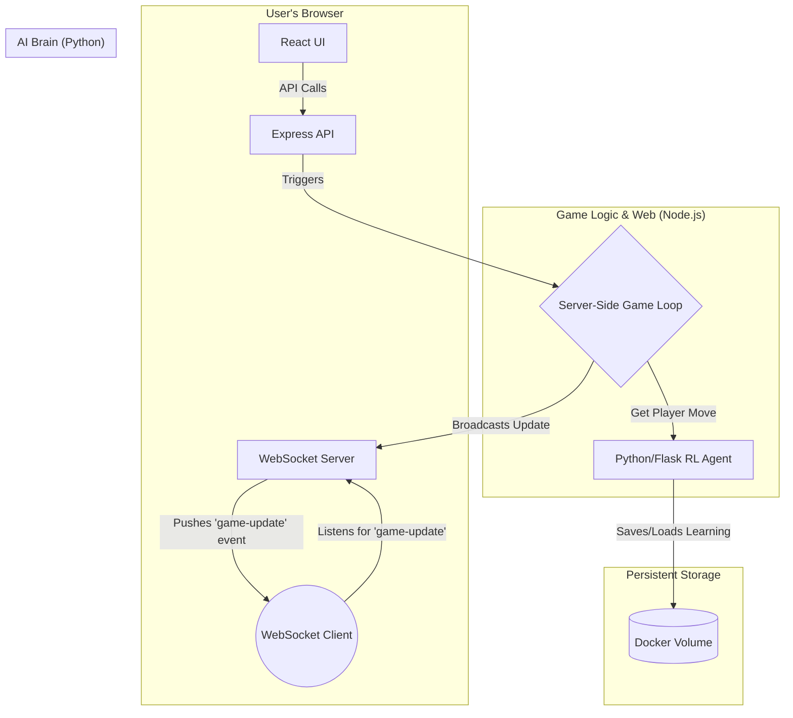

# Reinforcement Learning Tic-Tac-Toe Agent

This project is a full-stack application designed to train and play against a reinforcement learning agent for Tic-Tac-Toe. It is architected to be robust, scalable, and developer-friendly, using a containerized microservice approach.

## Getting Started

This project is managed using Docker and Make for a consistent and simple development experience.

**Prerequisites:**
- Docker
- Docker Compose
- Make

**To run the application:**

1.  **Build the services:**
    ```bash
    make build
    ```
2.  **Start the application:**
    ```bash
    make up
    ```
    This will start the React client, Node.js server, and Python agent. The client will be available at `http://localhost:3000`.

3.  **View logs:**
    ```bash
    make logs
    ```

4.  **Stop the application:**
    ```bash
    make down
    ```

## Architecture Overview

The system uses a microservice architecture to separate concerns and optimize for different workloads.



## Architectural Decisions

### Why a Microservice Architecture?

We separated the **Game Server (Node.js)** from the **AI Agent (Python)** to optimize for their conflicting operational profiles:

-   **Node.js Game Server (I/O-Bound):** The server's main job is handling concurrent web requests. Node.js's non-blocking event loop is ideal for this, providing high performance for many simultaneous users.
-   **Python AI Agent (CPU-Bound):** The agent's main job is computing moves, which is a CPU-intensive task. Separating it prevents these heavy computations from blocking the web server and making the UI unresponsive.

This separation provides clear benefits in scalability, resource allocation, and decoupled deployments.

### Persistence Strategy

The AI agent's "learning" (its Q-table or model weights) must be persisted across restarts. Saving this data inside a container is ephemeral.

To solve this, we use a **named Docker volume (`agent-data`)**. This volume is managed by Docker and mapped to a directory inside the agent's container (e.g., `/data`). The agent writes its state file to this directory, ensuring the data persists even if the container is destroyed and recreated. This is the standard practice for handling stateful services in a containerized environment.

## Component Breakdown

### 1. React Client (`client/`)
-   **Purpose:** Provides a UI for playing and observing games.
-   **Features:** Renders the board, handles human moves, and uses WebSockets to receive real-time updates for spectator mode.

### 2. Node.js Server (`server/`)
-   **Purpose:** Orchestrates game logic and manages players.
-   **Key Abstractions:** A `Player` interface with `HumanPlayer` and `RemoteAgentPlayer` implementations.
-   **Game Modes:** Supports both interactive "Human vs. Agent" games and passive "Agent vs. Agent" spectator games.

### 3. Python Agent (`agent/`)
-   **Purpose:** Contains the AI logic for choosing a move.
-   **Persistence:** Loads its state from the mounted `/data` volume on startup and saves its updated state back to the volume.
-   **API (`POST /get_move`):** Receives a board state and returns the agent's chosen move.